# AP Project - Mitochondrial Genome Analysis Software

## Overview
This software is designed to analyze mitochondrial genomes. Its analysis includes:

* Calculating GC content and sequence statistics;
* Identifying conserved motifs across sequences;
* Performing pairwise sequence alignments;
* Generating and analyzing mitochondrial DNA-derived data, such as motifs and alignment results.

The project includes a web interface built using the *Flask* library. Each page of the web interface corresponds to specific actions, ensuring a user-friendly and intuitive experience.

## Features
To operate the software, users upload a file containing mitochondrial genome sequences on the Home Page.
Then, they choose the number of genomes to be analyzed (single genome, two genomes, all genomes).
Finally, users can run specific analyses; sometimes, they are required to follow prompts on the interface to specify some parameters, such as start and stop indices for subsequence extraction, motifs to search for, or genome names to compare specific sequences.

### Home Page
On the **Home Page**, the user can upload a file containing mitochondrial genome data; supported extensions include *.FASTA* and *.txt*. 
The file is processed using the *`MitochondrialDNAParser`* class.

### Genome Selection Page
Once a compatible file is submitted, the user is brought to the **Genome Selection Page**.
The names of all the genomes present in the file are displayed and the user can choose to analyze one, two, or all the genomes in the file.

*genomes display example*: 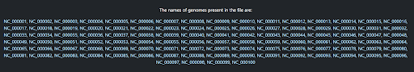

### Single Genome Analysis
When *‘one genome’* is selected, users choose the genome to be analyzed;

*genome name selection example*: 

Then, they select the analysis to be performed from all the available options:
* **GC Content and Length Analysis**: using the `MitochondrialDna` class, it summarizes GC content and length of the genome selected;

   *output example*: 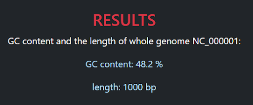
  
* **Subsequence Extraction**: inputing the start and end indexes, it extracts a subsequence, prints it, and calculates its GC content and length using the `MitochondrialDna` class;

  *input example:* 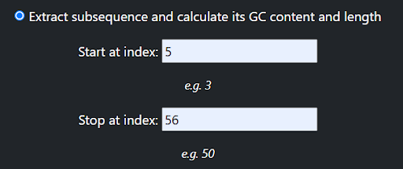
  
  *output example:* 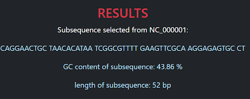
  
* **Motif search**: searches for a specific motif, given as input by the user, identifies its positions, occurrence count, and distribution using the `GenomicMotif` class;

  *input example:* 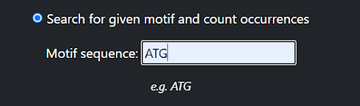
  
  *output example:* 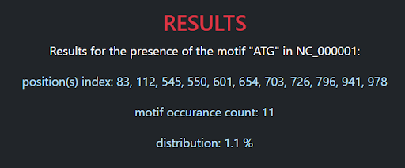
  
* **Sequence Alignment**: aligns the input sequence with an external sequence, provided by the user through a second input.

  *input example:* 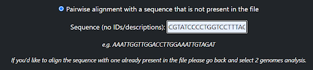
  
  *output example:* 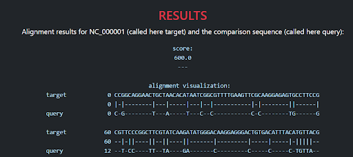

### Two Genome Analysis
When *‘two genomes’* is selected, the user chooses the two genomes to be analyzed; then, he selects the analysis to be performed from all the available options:

* **General Comparison**: using the `ComparativeAnalysis` class, it conducts comparative analysis on the GC content and length of the genomes selected;

  *output example:* 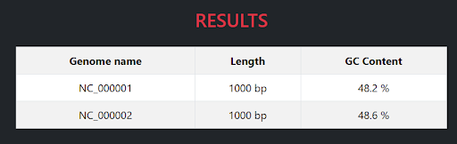
  
* **Motif Search across two genomes**: it identifies a conserved motif inputted by the user and its positions in each genome using the `ConservedMotifs` class;

  *output example:* 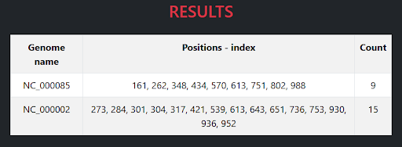
  
* **Pairwise Sequence Alignment**: using the `AlignmentAnalysis`  class, it performs alignment operations between the sequences of the two selected genomes and provides the alignment score of the two sequences.

  *output example:* 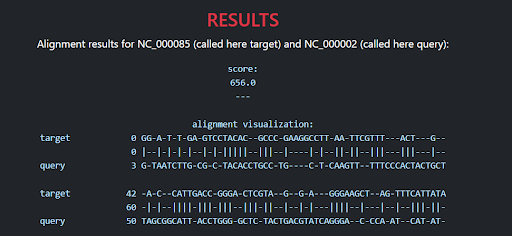

### All Genome Analysis

* **GC Content and Length Comparison**: using the `ComparativeAnalysis` class, it compares the GC content and length of all the sequences present in the uploaded file;

  *output example:* 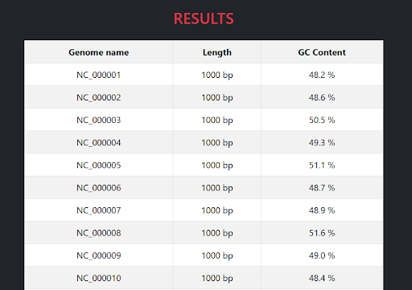
  
* **Motif Search across all genomes**: using the `ConservedMotifs` class, it detects a conserved motif inputted by the user and its occurrences across all genomes.

  *output example:* 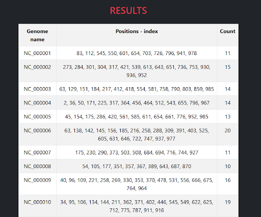

## Installation
In order to run the scripts in this repository, the following first steps will need to be ensured:

1. Download and install the Python software IDE of preference;
2. Clone/Fork the repository to a folder of preference;
3. Open all the files through the preferred IDE;
4. Run the *main.py* script;
5. Access the web interface (at [http://localhost:5000]).

To properly run the software in Python, the following dependencies are needed:

* Python (version 3.12 is reccomanded)
* pip
* flask
* os
* werkzeug.utils
* pandas
* Bio

## Development Process
### Modular Approach
The software has a modular design; classes and methods were grouped based on functionality:

* **`MitochondrialDNAParser` class**: retrieves all data from the file uploaded by the user and parses it in a structured and organized asset;
* **`MitochondrialDna` class**: handles individual genome analysis, including GC content, sequence length, and subsequence operations;
* **`GenomicMotif` class**: identifies and represents motifs within a single genome;
* **`ComparativeAnalysis` class**: supports comparative operations for multiple genomes, including GC content and length comparisons;
* **`ConservedMotifs` class**: detects conserved motifs across multiple genomes;
* **`AlignmentAnalysis` class**: manages pairwise alignment operations.

Common operations, like GC content and length calculation or motif searching, were implemented in base classes and reused to avoid redundancy.

The codebase is structured to allow easy addition of new analysis features.

### Working Flow of the Software
The ***’main.py’* file** is the heart of the application, since it provides web integration for the software. The core genomics analysis logic was decoupled from the web interface logic, improving maintainability of the whole code and allowing for a clear separation of concerns. 

The HTML code for the web interface is located in the repository under the *'templates'* folder. The development follows a modular structure, with each file serving a specific role:

* `base.html`: the main file that provides the basic layout and shared elements for all pages; serves as the foundation for all other pages
* `index.html`: the Home Page where users can upload their genomic data files;
* `choose_analysis.html`: the Genome Selection Page where the uploaded genomes are displayed and users choose the type of analysis to perform;
* `one_genome.html`: provides options for analyzing a single genome, such as GC content and motif analysis; performs those actions based on the user's input;
* `two_genomes.html`: allows comparison between two selected genomes, highlighting differences and similarities through different actions based on the user's input;
* `all_genomes.html`: provides analysis across all uploaded genomes, identifying differences and similarities, conserved features and variations;
* `results.html`: displays the results in a textual format for analyses that do not require tabular representation;
* `results_table.html`: presents the results in a tabular format, for comparisons and summary data.

The HTML development leverages **Bootstrap**, an open-source front-end framework that helps designing responsive and visually appealing websites. Its collection of components and its grid system ensure consistency and scalability to the code.

*Flask* library was chosen to handle requests and route them to the corresponding functions, providing seamless interaction between the backend template logic and frontend HTML elements. Here’s a breakdown of its working flow:

1. The *‘mtDNA_parser.py’* file and its class are initialized to parse uploaded FASTA/txt files. File integrity is validated; genome sequences are extracted into structured data and stored in memory, ready for downstream analysis and visualization.
2. The web interface presents the genome names parsed from the uploaded file. The user selects the number of sequences to analyze (1, 2, or all).
3. Depending on user input, the selected genome/s is/are analyzed:
*  In case of a single-genome analysis, the methods used belong to the  `MitochondrialDna` and `GenomicMotif` classes (*‘mtDNA.py’* file), or to the `AlignmentAnalysis` class (*mtDNA_comparison.py* file);
*  In case of a two-genomes or all-genomes analysis, the methods used belong to the `ComparativeAnalysis`, `ConservedMotifs`, or `AlignmentAnalysis` classes (*‘mtDNA_comparison.py’* file).
4. Results are displayed dynamically on the webpage:
*  Each page corresponds to a Flask route (*/upload, /choose_analysis, /one_genome, /two_genomes, /all_genomes*, etc.);
*  Data is passed between routes via Flask's request and session objects.

Extensive testing was performed to validate the accuracy of results and the stability of the web interface.
Robust **error-handling mechanisms** were incorporated to ensure a smooth user experience; some include:

* **File validation**: ensures that uploaded files are in the correct format and provides error messages if the file is invalid or improperly formatted;
* **Input verification**: checks for valid indices when extracting subsequences and validates motif input to ensure compatibility with the analysis methods;
* **Runtime errors**: catches unexpected errors during analysis (for example empty sequences, incompatible alignments, etc.) and displays informative messages without crashing the application.

## Development Resources
To support the development and provide a clear overview of the software's architecture, **CRC cards** and **UML diagrams** were created. These resources outline the structure, responsibilities, and relationships between classes, offering further details on the design choices made during implementation.

These additional development resources can be found in the *documentation* folder of this repository.

## Future Work
Potential enhancements include:

* Adding support for more file formats
* Expanding analysis features
* Improving visualization capabilities

## Authors
This project was developed by Carolina Cretu, Saraya Tissera, Sofia Pasquale, and Raissa Costea as part of the Advanced Programming exam for the Genomics Bachelor's program at the University of Bologna.

